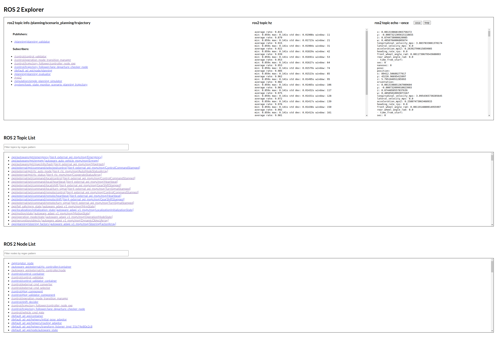

# ros2_explorer

For those who frequently use ros2 node info, topic info, echo, hz, param, etc. You can access these information with just one click.



## install and run

**via pipx**

install:
```sh
pipx install git+ssh://git@github.com/TakaHoribe/ros2_explorer.git
```

run:
```sh
ros2_explorer
```

The application will automatically open in your browser, otherwise access to `http://127.0.0.1:8050/` manually.

<!--  -->

Note: if you want to run directly, run the following command:

```sh
pip install -r requirements.txt
python3 ./script/ros2_explorer.py
```

## how this works


